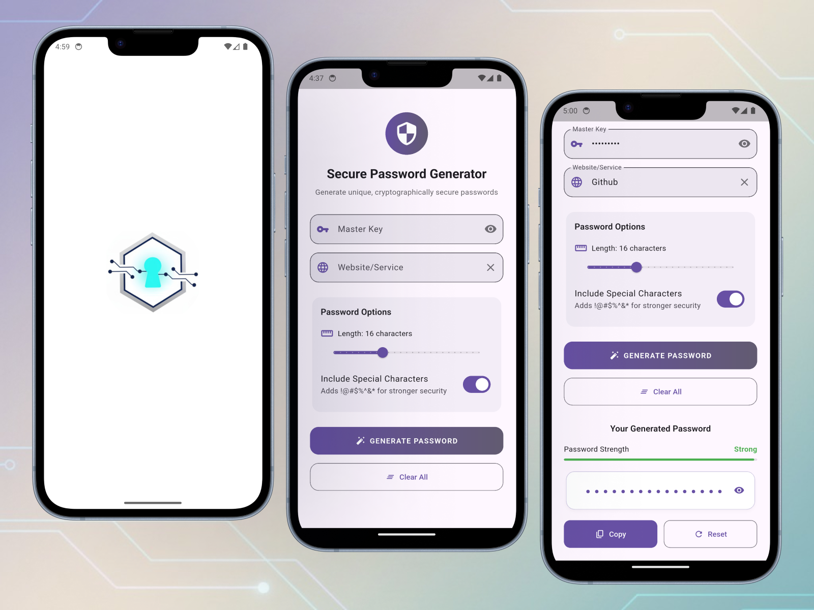

# FortiPass - Secure Password Generator

FortiPass is a Flutter-based password generator that creates strong, unique, and cryptographically secure passwords for all your online accounts. It works offline and never stores your master key or generated passwords, ensuring maximum privacy and security.

## 🚀 Features

- **Cryptographically Secure:** Uses SHA-256 with 1000 iterations to generate passwords, ensuring they are highly resistant to brute-force attacks.
- **Deterministic Generation:** The same master key and website/service name will always produce the same password, allowing you to regenerate passwords without storing them.
- **Customizable Passwords:**
  - Adjust the password length from 8 to 32 characters.
  - Option to include or exclude special characters (`!@#$%^&*`).
- **Password Strength Indicator:** Visual feedback on the strength of your generated password (Weak, Medium, Strong).
- **Modern UI:** A clean, intuitive, and animated user interface built with Material Design principles.
- **Haptic Feedback:** Subtle vibrations for a better user experience on supported devices.
- **Cross-Platform:** Built with Flutter, allowing it to run on Android, iOS, Web, and Desktop from a single codebase.

## 🛠️ How It Works

The password generation process is based on a combination of your **Master Key** and the **Website/Service Name**.

1.  **Input:** You provide a secret master key and the name of the service (e.g., "google.com").
2.  **Hashing:** The app combines these inputs with a salt (`PassGen2024`) and hashes them using **SHA-256**.
3.  **Stretching:** The hash is then re-hashed 1000 times to increase its resistance to attacks (key stretching).
4.  **Encoding:** The final hash is encoded into a Base64 string.
5.  **Character Mapping:** The encoded string is mapped to a character set to create a password of your desired length and complexity.

This deterministic process ensures that you can always regenerate the same password by providing the same inputs, without ever needing to save the password itself.

## Screenshots


## 📱 App Link

Try FortiPass now: [https://t.me/SolveIt102/17](https://t.me/SolveIt102/17)

## ⚙️ Getting Started

### Prerequisites

- [Flutter SDK](https://flutter.dev/docs/get-started/install)
- An editor like [VS Code](https://code.visualstudio.com/) or [Android Studio](https://developer.android.com/studio).

### Installation

1.  **Clone the repository:**
    ```bash
    git clone https://github.com/your-username/forti_pass.git
    cd forti_pass
    ```

2.  **Install dependencies:**
    ```bash
    flutter pub get
    ```

3.  **Run the app:**
    ```bash
    flutter run
    ```

## 📂 Project Structure

```
lib/
├── main.dart
├── models/
│   └── password_state.dart
├── providers/
│   └── password_provider.dart
├── views/
│   └── pass_gen_view.dart
└── widgets/
    ├── action_buttons.dart
    ├── clear_button.dart
    ├── generate_button.dart
    ├── header_widget.dart
    ├── master_key_field.dart
    ├── password_card.dart
    ├── password_options_card.dart
    ├── password_output_section.dart
    ├── password_strength_indicator.dart
    └── website_field.dart
```

- `main.dart`: Initializes the Flutter app and sets up the main theme and home widget.
- `models/password_state.dart`: Contains the state model for the password generator, built using Freezed.
- `providers/password_provider.dart`: Contains the `StateNotifier` for managing the password generation state using Riverpod.
- `views/pass_gen_view.dart`: The main screen of the application, composed of smaller widgets.
- `widgets/`: Contains all the reusable UI components for the password generation view.

## 🤝 Contributing

Contributions are welcome! If you have ideas for improvements or find any bugs, feel free to open an issue or submit a pull request.

## 🌟 Thank You